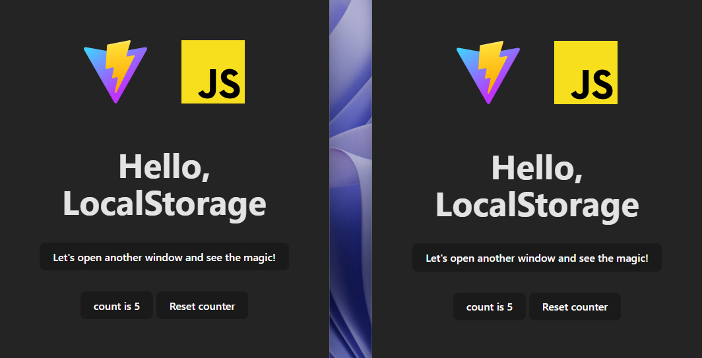

# Window Communication ✨

This is a practice project, serving as an exploration of interesting concepts that I plan to delve into in the future.

## Descripción 👀

Using the basic Vite counter template, I built an app for bidirectional communication between windows. It utilizes a listener on the local storage to update the counter:

```javascript
window.addEventListener('storage', () => {
  setStorage.initialState()
})
```

## Capturas de Pantalla 💻


The basic functionality is that whenever the counter value changes, it updates the local storage, and other windows are automatically refreshed by listening to the ‘storage’ event.


## Run Locally 🚀

Clone the project

```bash
  git clone https://github.com/SantiagoCode/vanilla-practice.git
```

Go to the project directory

```bash
  cd vanilla
```

Install dependencies

```bash
  npm install
```

Start the server

```bash
  npm run dev
```

## Author

- [@SantiagoCode](https://www.github.com/SantiagoCode) 😉